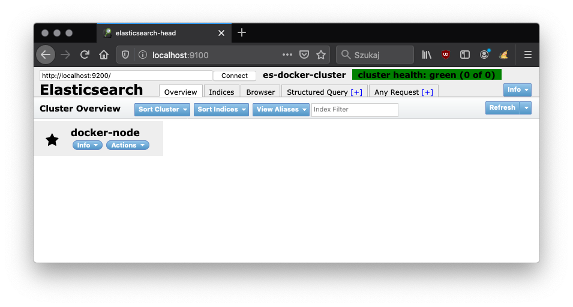

Elasticsearch-head
========================
Containerized web application for browsing and interacting with an Elasticsearch cluster. [http://mobz.github.io/elasticsearch-head/](http://mobz.github.io/elasticsearch-head/)

Docker Image
------------
[](https://microbadger.com/images/slydeveloper/elasticsearch-head "Get your own image badge on microbadger.com")<br />
[](https://microbadger.com/images/slydeveloper/elasticsearch-head "Get your own version badge on microbadger.com")<br />
[](https://hub.docker.com/r/slydeveloper/elasticsearch-head)

Info
----
- Name: `slydeveloper/elasticsearch-head`
- Version: `latest`,`1.0`
- [Docker Hub](https://hub.docker.com/r/slydeveloper/elasticsearch-head/)

Details
--------
- Image based on `node:13.8`
- Pre-installed: `elasticsearch-head`

Configuration
--------------
An Elasticsearch-head requires CORS enabled on Elasticsearch cluster:
* `http.cors.enabled: true`
* `http.cors.allow-origin: "*"`

Usage
--------
```docker run --rm -p 9100:9100 slydeveloper/elasticsearch-head```

Screenshot
-----
